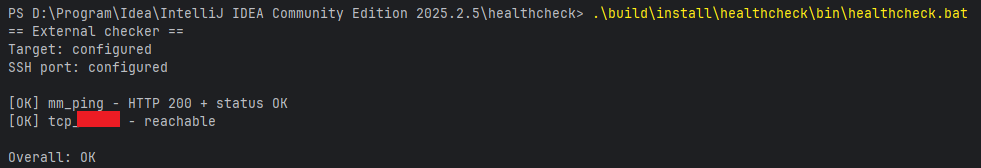
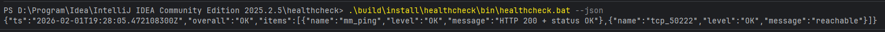

# healthcheck

External checker for a Mattermost VPS (HTTP + TCP + SSH auth).

---

## Requirements

- Java 21+
- Windows / Linux / macOS
- SSH key-based auth configured

---

## Run (Gradle)

.\gradlew.bat run
.\gradlew.bat run --args="--json"
.\gradlew.bat run --args="--verbose"

## Screenshots

